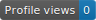

# 💫 About Me

Hi, I'm **Nabasa Amos (Amos Quety)** — a full-stack software engineer focused on building scalable, low-bandwidth-friendly systems and intelligent applications.

I’m the creator of  **Xemora**, **AuthHub** and **PyCodeCommenter** a Python package that automatically generates meaningful comments and docstrings to improve code readability and maintainability.

I enjoy working at the intersection of **software engineering, data, and AI**, with a long-term vision of building impactful, scalable solutions.

---

## 🚀 What I’m Building

- Full-stack web and mobile applications using **React**, **React Native**, and **Node.js**
- Intelligent systems integrating **AI/ML** into real-world applications
- Developer tools and automation solutions (like **PyCodeCommenter**)

---

## 🌱 Current Focus Areas

- Advanced **AI/ML** (TensorFlow, PyTorch)
- **Scalable system design** and low-bandwidth optimization
- **Cloud architecture** (AWS & Google Cloud)

---

## 👯 Open to Collaborate On

- High-impact full-stack applications  
- AI-powered systems and tools  
- Open-source projects with real-world utility  

---

## 💬 Expertise

- Frontend & mobile: React, React Native, Next.js  
- Backend: Node.js, Express, Flask  
- Databases: MongoDB, Firebase  
- Applied AI & data-driven systems  

---

## ⚡ Insight

I’m driven by solving real-world problems with technology — especially in environments where **performance, scalability, and bandwidth efficiency matter most**.

---

## 🌐 Connect With Me

  
  

---

## 🧠 Featured Project

### 🔹 PyCodeCommenter
A Python package that generates structured comments and docstrings for functions and classes.

- Improves code readability and maintainability  
- Built for developers who value clean, self-documented code  
- Designed with extensibility in mind  

---

## 🌍 Portfolio

🔗 https://nabasa-amos.netlify.app  

> Explore my projects, experiments, and technical journey.

---

## 💻 Tech Stack

### Languages

### Frontend

### Backend

### Databases

### AI/ML

### Tools

---

## 📊 GitHub Analytics

The Stats and Top Langs cards are generated from the self-hosted GitHub Readme Stats endpoint configured in `GH_STATS_BASE_URL`.
---

## 🏆 Achievements

---

## 👀 Profile Views

